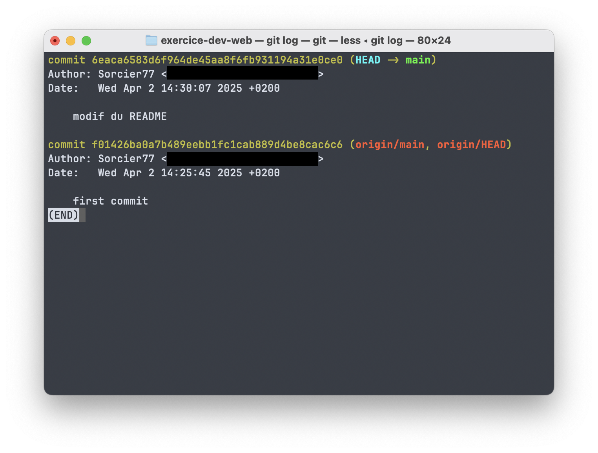

# Exercice : Suivre l'évolution d'un fichier avec GIT.

  

## 1. créer un projet et l'initialiser avec Git.

## 2. créer un fichier(ce README) et faire un premier commit.

  

## 3. Modifier le fichier et voir l'historique

  

Pour modifier le fichier et voir l'historique :

  

```bash

# Modifiez le fichier README.md avec votre éditeur

nano README.md

# ou

code README.md

  

# Ajoutez les modifications à l'index

git add README.md

  

# Créez un commit avec vos modifications

git commit -m "Modification du README.md"

  

# Affichez l'historique des commits

git log

# ou pour un affichage plus compact

git log --oneline

```



## 4. Revenir à une version précédente

  

```bash

# Pour voir l'historique et identifier le commit auquel revenir

git log --oneline

  

# Pour revenir temporairement à un commit précédent (sans modifier l'historique)

git checkout <hash_du_commit>

  

# Pour revenir à la version actuelle (la plus récente)

git checkout main

  

# Pour annuler les changements et revenir à un commit antérieur (modifie l'historique)

git reset --hard <hash_du_commit>

```

  

## 5. Créer un dépôt GitHub et y envoyer le projet

  

```bash

# Créez un nouveau dépôt sur GitHub (via l'interface web)

# Puis liez votre dépôt local au dépôt distant

git remote add origin https://github.com/votre-username/exercice-dev-web.git

  

# Envoyez votre code vers GitHub

git push -u origin main

```

  

## 6. Créer une nouvelle branche

  

```bash

# Créez une nouvelle branche

git branch nouvelle-fonctionnalite

  

# Basculez vers cette nouvelle branche

git checkout nouvelle-fonctionnalite

# ou en une seule commande

git checkout -b nouvelle-fonctionnalite

  

# Faites des modifications dans cette branche

# ...

  

# Ajoutez et commitez vos changements

git add .

git commit -m "Ajout de nouvelles fonctionnalités"

  

# Poussez la nouvelle branche vers GitHub

git push -u origin nouvelle-fonctionnalite

```

  

